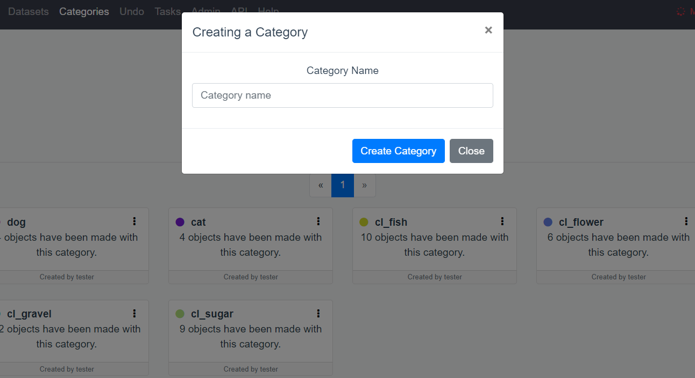
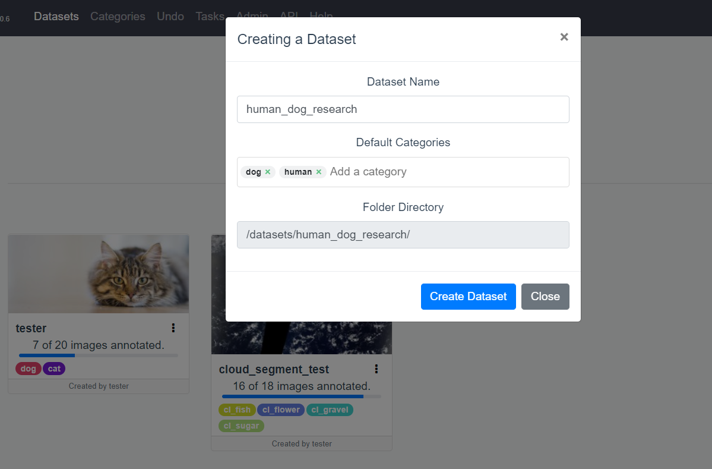
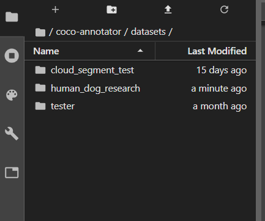
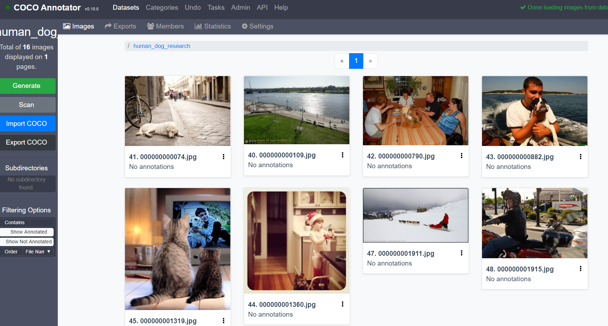
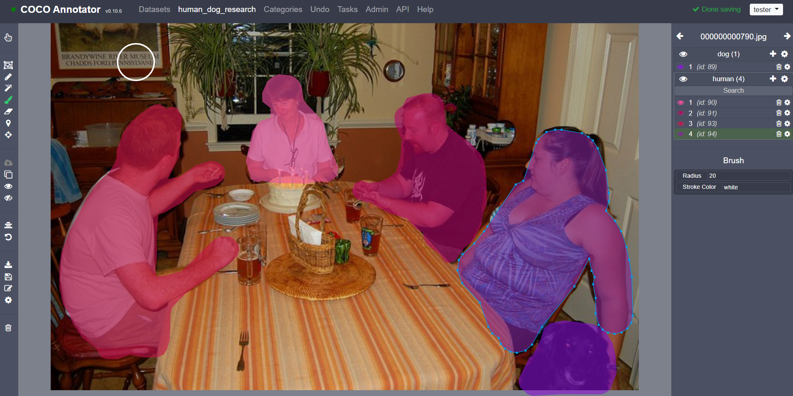
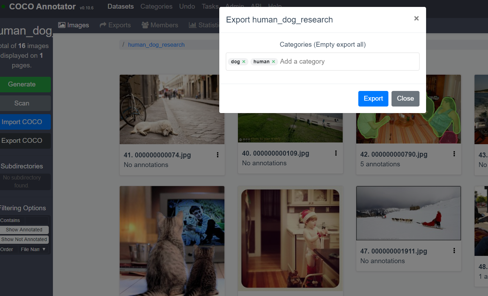
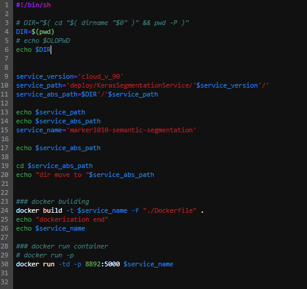

SS_POC-2019
=============

---
본 레퍼지토리는 스마트팩토리 등 이미지 영역 검출 Task인 Semantic Segmentation의 Proof of concept을 위한 것 입니다.


This repositoty is about Proof of concept related deep learning project related to Semantic Segmentation

All of module are implemented in Keras, Tensorflow environment

1.Requirements
------------

-	python(>= 3.6)
-   Docker(>=19.03.05)


2.Usage
-------------
### 2.1. 학습 환경 셋팅

* 리눅스 Docker 설치
~~~
$ sudo apt-get update
$ sudo apt-get install docker-ce docker-ce-cli containerd.io
~~~

도커 설치가 끝나면 터미널에서 docker명령어를 입력하여 도커가 정상적으로 설치되었는지 확인한다. 아래와 같이 출력되는지 확인 한다.
~~~
$ docker
Usage:  docker [OPTIONS] COMMAND
A self-sufficient runtime for containers
(이하 생략)
~~~


* 학습 환경을 위한 docker container 셋팅

~~~
$ sudo su
$ cd Deep_POC_2019
$ sh trainer.sh
~~~
root 계정으로 접속하여 Docker에 접근 권한을 얻는다. 다음으로 git clone한 Deep_POC_2019 폴더로 이동하여 sh trainer.sh 를 실행한다. trainer.sh 실행으로 segmentation model을 학습하기 위한 docker image를 가져와서 환경을 실행한다.

### 2.2. Annotator tool

Annotator tool은 coco 형식 기반의 segmentation dataset 생성 tool로, 사용자가 업로드한 img에 라벨별 영역을 표기하는 tool 이다.</br>
사용자는 카테고리 생성, 데이터셋 폴더 생성, 이미지 업로드, 이미지 Scan, 이미지 annotatin, 이미지 export를 통해 프로젝트의 데이터셋을 생성한다.


* annotator tool docker load

~~~
$ sh annotator.sh
~~~

1. 카테고리 생성
<br>프로젝트에 사용 될 label의 종류를 정의한다.</br>
<br></br>

2. 데이터셋 폴더 생성
<br>해당 프로젝트 데이터셋의 디렉토리 이름을 정의한다.</br>
<br></br>

3. 데이터셋 폴더 경로
<br>아래와 같이 ./coco-annotator/dataset 에 위에서 생성한 디렉토리 이름 기반의 폴더가 생성된다.</br>
<br></br>

4. 이미지 Scan
<br>데이터셋 폴더 경로에 이미지를 업로드 및 coco-annotator의 scan 클릭 후 새로고침을 누르면 데이터셋이 반영된다.</br>
<br></br>

5. 이미지 Annotation
<br>라벨 영역을 추가 할 때 우측 해당 라벨의 '+' 를 클릭 후 영역을 표기한다. 동일 라벨을 다른 영역에서 추가할 경우(ex. 아래의 여러사람) 우측의 해당 라벨의 '+' 를 클릭 후 추가한다. </br>
<br></br>

6. Annotation export
<br>Annotation이 완료된 후 Dataset 영역 좌측의 Export COCO를 클릭한다. 해당 이미지 디렉토리의 하위(./coco-annotator/dataset/human_dog_research/.exports/)dp annotation json 파일이 생성된다.</br>
<br></br>


### 2.3. 모델 학습 및 최적화

1. 모델 학습 설정 셋팅
<br>모델 학습을 위한 셋팅에서 사용자가 입력하는 영역은 json_path, img_path, img_dir_name, model_name, epoch 이다.</br>
| variable | 설명 | 예시 |
| :--------- | :---------: | ---------: |
| json_path | coco-annotator를 통해 생성된 json 파일의 경로(가장 최근 파일) | "coco-annotator/datasets/human_dog_research/.exports/coco-1513442.94673.json" |
| img_path | coco-annoator에 저장된 이미지의 경로 | "/coco-annotator/datasets/human_dog_research" |
| img_dir_name | 이미지 디렉토리 이름 | "human_dog_research" |
| model_name | train에서 설정할 버전명 | "v_1" |
| epoch | 학습 epcoh 설정(50 권장) | 50 |

<br></br>


2. 모델 학습 및 최적화
<br></br>

~~~
$ sh trainer.sh
~~~


### 2.4. Docker 생성, serving

1. 모델 serving 설정 셋팅
<br>모델 serving을 위한 셋팅에서 사용자가 입력하는 영역은 service_version 이다. 앞서 학습에서 셋팅한 model_name과 동일하게 입력하면 된다. (ex. "v_1")</br>
<br></br>

2. 모델 docker 생성 및 serving

~~~
$ source server.sh
~~~


### 2.5. 예측 요청

~~~
$ curl -X POST "http://{주소}:8892/predict" -F image=@sample_image.png
~~~

3.Architectures
-------------

### 3.1. Semantic Segmenation
```
Deep_poc
│   train_serve.sh
│   trainer.sh
│   annotator.sh
│   
└───src
│       │   bento_deploy.py
│       │   data.py
│       │   deploy_valid_path.py
│       │   generator.py
│       │   keras_segment.py
│       │   metric.py
│       │   model.py
│       │   post_processing.py
│       │   predict.py
│       │   train.py
│       │   utils.py
│
└───coco-annotator
│       │   docker-compose.yml
│       │   ...
│       └───datasets
│           │   ...
│           └───cloud_segment
│               │   00a0954.jpg
│               │   ...
│               └───.exports
│                   │   coco-00000.json
│                   │   ...
│
│   
└───result
│        └───cloud_segment
│             └───segment
│             │   └───cloud_v80
│             │        └───graph
│             │        │   │   tesnorboard log
│             │        └───log
│             │        │   │   log.out
│             │        └───model
│             │        │   │    model_epoch_loss.h5
│             │        └───prediction
│             │            │   dict_prediction
└───deploy
│        └───KerasSegmentationService
│             └───segment
│             │   └───cloud_v80
│             │        │   Dockerfile
│             │        │   bentoml.yml
│             │        │   ...
│             │        └───KerasSegmentationService
│             │            │   bento.yml
│             │            │   deploy_valid_grid.py
│             │            │   keras_segment.py
│             │            │   metric.py
│             │            │   model.py
│             │            │   utils.py


```


<!-- 1.	binary iamge classification
2.	multi-label image classification
3.	multi-class image classification\*\*\* -->


4.Reference
---------

| Type      | Task                             | Reference link                                   |
|-----------|:--------------------------------:|-------------------------------------------------:|
| Image     | multi-class image classification | <a>https://github.com/BIGBALLON/cifar-10-cnn</a> |
| Annotator     | Image segmenation annotator | <a>https://github.com/jsbroks/coco-annotator</a> |
| API     | COCO Python API | <a>https://github.com/cocodataset/cocoapi/tree/master/PythonAPI</a> |
| Segmenation     | Segmentation_models | <a>https://github.com/qubvel/segmentation_models</a> |
| Image     | Keras efficientnet | <a>https://github.com/qubvel/efficientnet</a> |